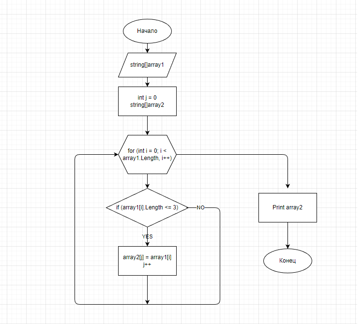

# FinalHomeWork(ИТОГОВАЯ ПРОВЕРОЧНАЯ РАБОТА)

## Задача 

Написать программу, которая из имеющегося массива строк формирует массив из строк, длина которых меньше либо равна 3 символам. Первоначальный массив можно ввести с клавиатуры, либо задать на старте выполнения алгоритма. *При решение не рекомендуется пользоваться коллекциями, лучше обойтись исключительно массивами*.

## Описание алгоритма решения

1. Объявляется изначальный массив. 
2. Инициируется результирующий пустой массив(его длина равна первому массиву).
3. В цикле, соразмерном длине принимаемого массива, проверяем условие: длина элементов <=3, если условие выполнено - элемент принимаемого массива(i) заносится в j элемент второго массива. 
4. После присвоения увеличивается переменная j на 1 и возвращается к циклу for в котором i увеличивается на 1. И так проверяется до конца. 
5. Метод возвращает новый массив.
6. Печатаются непустые элементы второго массива.

### Блок-схема алгоритма

## Программа:

Реализация алгоритма осуществляется по пути *OperationArray/Program.cs* . Для запуска программы необходимо перейти в соответствующую папку и запустить программу через терминал: *dotnet run*
