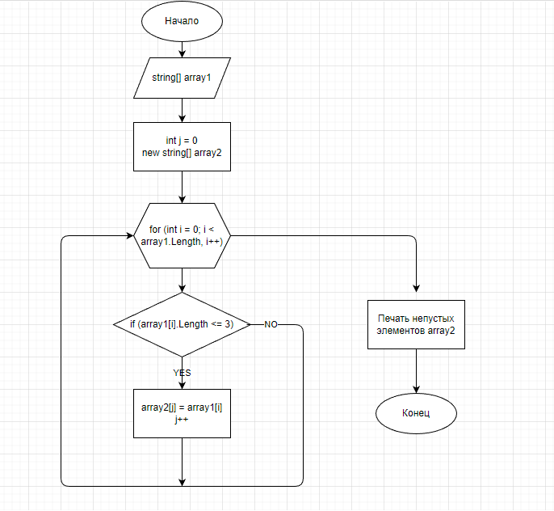

# FinalHomeWork(ИТОГОВАЯ ПРОВЕРОЧНАЯ РАБОТА)

## Задача 

Написать программу, которая из имеющегося массива строк формирует массив из строк, длина которых меньше либо равна 3 символам. Первоначальный массив можно ввести с клавиатуры, либо задать на старте выполнения алгоритма. *При решение не рекомендуется пользоваться коллекциями, лучше обойтись исключительно массивами*.

## Описание алгоритма решения

1. Объявляется изначальный массив строк 
2. Инициируется результирующий пустой массив (его длина равна первому массиву).
3. В цикле проверяется каждый элемент первого массива на длину: если она <= 3, то добавляем этот элемент в результирующий массив
4. Выводит в консоль изначальный массив и результирующий (пустые элементы игноируются)

## Блок-схема алгоритма

## Программа

Реализация алгоритма осуществляется в файле *OperationArray/Program.cs* . Для запуска программы необходимо перейти в соответствующую папку и запустить программу через терминал: *dotnet run*
